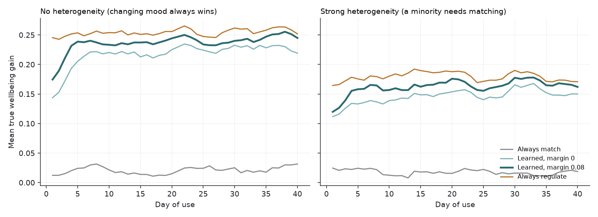
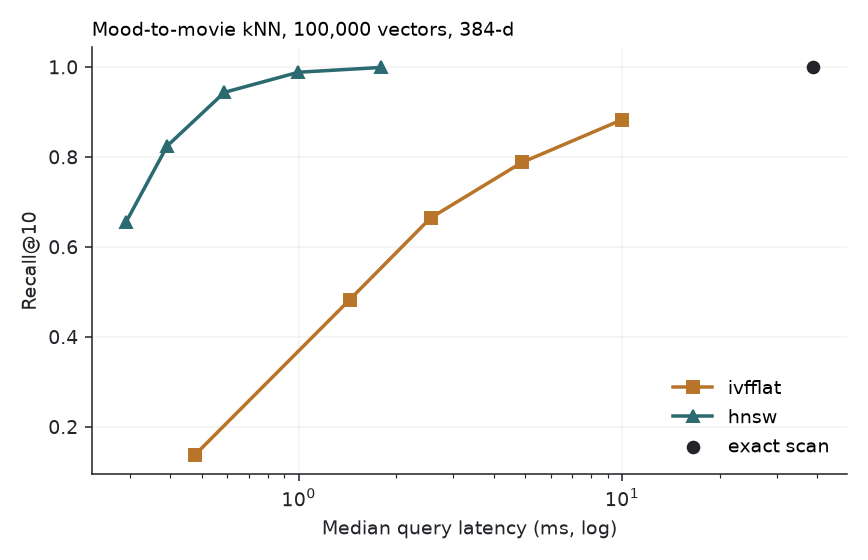
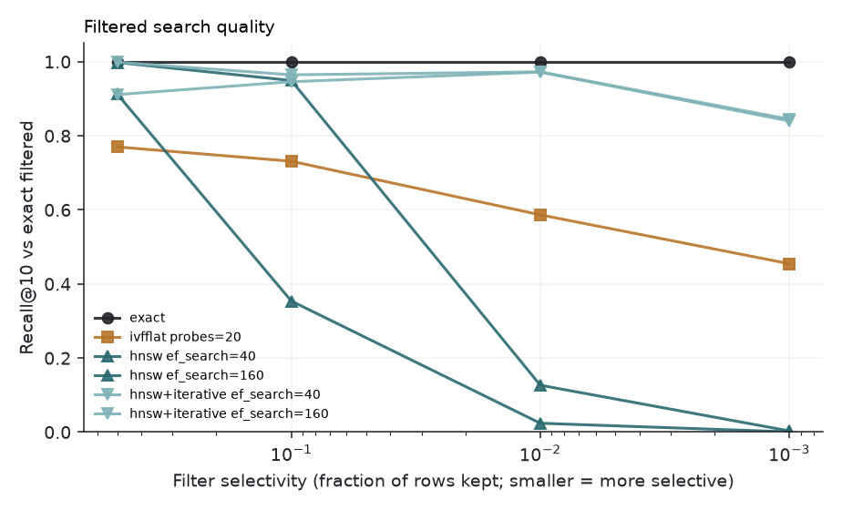
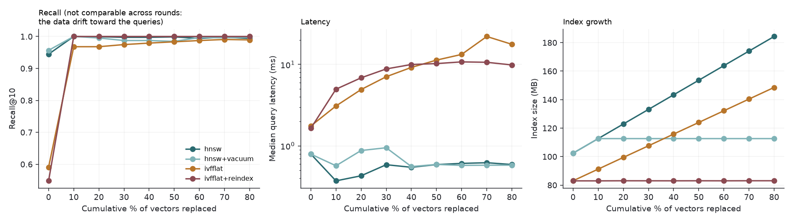

# Reel State: a mood-adaptive movie recommender built around a vector database

*Advanced Database Systems project. Every number below comes from a file under `reports/`; the command that regenerates it is in the README.*

## 1. Summary

Reel State senses a person's mood from three weak-to-strong signals (how they type, a short adaptive quiz, time of day), stores it as a **continuously updated vector** next to the movie vectors, and recommends films through **one SQL query** that combines vector search with relational filters. After a film, the person says how they feel, and that outcome trains a per-person policy that decides whether to **match** their mood or **change** it.

What the evidence supports, and what it does not:

| Claim | Verdict | Evidence |
|---|---|---|
| The end-to-end system works on 13,174 real movies | **Shown** | 28 automated tests; browser walkthrough of the whole loop |
| Recommended films fit the mood and are well rated | **Shown** | §5.1: mood-fit error 0.23 vs 0.87 random; mean rating 3.76 vs 3.30 |
| The adaptive quiz needs fewer questions for the same accuracy | **Shown (simulated)** | §5.2: 4.1 vs 5 questions; fused system 2.9 |
| Typing adds useful evidence | **Weakly** | §5.2: mood error 0.572 vs 0.615 without it |
| A learned per-person match-vs-regulate policy **improves net outcomes** | **Not shown** | §5.3: reaches parity with "always regulate", does not beat it |
| The policy **identifies who needs matching** | **Shown (simulated)** | §5.3: 25% match for cathartic users vs 4–5% for others |
| Fairness-aware household blending beats simple averaging | **Not shown** | §5.4: all rules within noise |
| Borrowing the population's experience helps new users; similar-mood neighbours help | **Inconclusive** | §5.2: intervals overlap |
| HNSW vs IVFFlat trade-offs under filters and churn | **Shown (measured)** | §5.5 |
| It works for real people | **Not tested** | the pilot has not been run |

The simulator results are about the *mechanism*, under stated assumptions. They are not evidence about people.

## 2. The idea and why it is not just another recommender

Each ingredient exists alone: typing rhythm correlates with arousal; chatbots ask people how they feel; Mood Management Theory (Zillmann) says people sometimes want content that mirrors a mood and sometimes the opposite; vector databases do fast similarity search. The contribution is wiring them together around the database:

1. Mood is a **first-class vector object**, append-only (`mood_state`, the history) with a live view (`mood_current`, one row per user, rewritten on every reading).
2. Mood and movies share **one embedding space**, so "which film fits this mood" is one ANN query with SQL filters.
3. The loop is **closed on a felt outcome**, not a click.

## 3. System design

```
 typing rhythm ─┐                                        ┌─ similar-mood neighbours (live ANN index)
 adaptive quiz ─┼─► fusion (OU drift + precision) ─► mood_state ─┤
 time of day  ──┘                                   mood_current └─► policy ─► match | regulate
                                                                          │
   target mood ─► affect_space.embed ─► HNSW + filters ─► rerank ─► explained slate
                                                                          │
   policy update ◄── post-watch check-in (felt outcome) ◄─────────────────┘
```

### 3.1 Data

* **MovieLens 25M** movies with Tag Genome scores and ≥50 ratings: **13,174 movies**, 395,220 stored top tags.
* **TMDB** overview, runtime, language for 13,041 of them (the rest were not found).
* Embeddings: `all-MiniLM-L6-v2` (384-d) over title, genres, overview and the 12 strongest genome tags.

### 3.2 Movie affect

Each movie gets a valence (unpleasant→pleasant) and arousal (calm→intense) score from the Tag Genome through a **hand-assigned tag lexicon** (`affect.py`, 176 tags). Sanity check: *Saw*, *Requiem for a Dream*, *Grave of the Fireflies* land at the unpleasant end; *Toy Story*, *Amélie* at the pleasant end; *Fury Road* at the top for arousal. It is debatable in places (it scores *The Shawshank Redemption* as pleasant) and is isolated so it can be replaced or ablated.

### 3.3 A mood in movie space

`affect_space.py` fits a ridge map from (valence, arousal) to the expected content embedding. Evaluating it gives the embedding of "a typical film that feels like this mood".

### 3.4 Sensing and fusion

* **Adaptive quiz** (`quiz.py`): graded-response IRT on two latent axes, a 20-item bank, posterior on a grid. The next question is the one with the largest expected reduction in posterior variance; it stops when both axes are confident. Answers given very fast or very slowly are down-weighted.
* **Typing** (`typing_features.py`): the browser sends only the gap between keys and a coarse key class, **never which character**. The server keeps five derived features, scored against the user's own baseline, and treats them as a high-variance observation.
* **Fusion** (`fusion.py`): each axis is a Gaussian belief that **drifts** (Ornstein-Uhlenbeck, 6-hour half-life) and is updated by precision weighting. A stale mood therefore becomes uncertain and triggers a question; a fresh one does not.

### 3.5 Retrieval

One SQL statement (`recommend.py`): relational filters (runtime, language, genre, already-seen) plus ANN ordering by cosine distance over an HNSW index, 400 candidates. They are then re-ranked by cosine, affect distance to the target, a Bayesian-average quality margin, and a boost for films that worked for people whose mood right now resembles yours (a nearest-neighbour query on `mood_current`). A quality floor and slate sampling keep results good and varied.

### 3.6 Policy

Per user and mood quadrant, a Beta bandit over {match, regulate} with:
a population prior (new users start from others' averages), partial pooling of a person's evidence across their other moods, and a **switch margin** (leave the default "regulate" only when the other arm's draw beats it by 0.08).

### 3.7 Privacy by design

Raw keystroke data is never stored (an automated test asserts it). Profiles live in the browser with a secret token whose hash alone is stored; the user list is not public. `pilot.py delete <id>` removes everything about a participant.

## 4. Implementation

PostgreSQL 17 + pgvector 0.8.7; Python 3.12 / FastAPI / psycopg; plain HTML/JS client; 8 migrations; 28 tests (unit, simulation and database integration).

## 5. Results

### 5.1 Retrieval quality (`reports/retrieval_summary.md`)

300 random moods × 5 films:

| Pipeline | Mood-fit error (lower is better) | Mean MovieLens rating | Rated ≥ 3.5 | Distinct films / 1500 |
|---|---|---|---|---|
| Random film | 0.873 | 3.30 | 39% | 1429 |
| Vector search only | 0.532 | 3.20 | 20% | 50 |
| + affect rerank | 0.179 | 3.23 | 31% | 166 |
| **Shipped** | **0.231** | **3.76** | **94%** | **283** |

Two findings changed the design. Vector search alone captures only a third of the mood fit and concentrates on 50 films; the affect rerank supplies the precision. And the first version, tuned for mood fit alone, recommended films of exactly average quality (3.23) and few of them; adding a quality floor and varied slates gave up a little mood fit for much better and more varied films. A 100-candidate pool could not support this; 400 can.

The HNSW slate matches exact search (0.99–1.00 top-5 overlap, including filtered queries) and is up to 11× faster (1.3 ms vs 14.5 ms).

### 5.2 Sensing (`reports/v1/sim_summary_v1.md`, first simulation run)

60 synthetic users × 40 days × 3 seeds, mood estimate error as distance in the valence-arousal square:

| Sensing | Mood error | Questions / session | Gain, last 10 days |
|---|---|---|---|
| Context only | 0.615 ± 0.005 | 0 | +0.129 ± 0.006 |
| Typing + context | 0.572 ± 0.010 | 0 | +0.135 ± 0.060 |
| Fixed 5-question quiz | 0.364 ± 0.025 | 5.00 | +0.223 ± 0.061 |
| Adaptive quiz | 0.387 ± 0.016 | 4.08 | +0.212 ± 0.042 |
| Everything fused | 0.398 ± 0.001 | **2.86** | +0.210 ± 0.015 |

* **The quiz is the main sensor.** Knowing the mood is worth about +0.08 gain over guessing from context.
* **Typing is a weak helper** (7% lower error), as designed. It is not a mood detector.
* The adaptive quiz uses 18% fewer questions for 6% more error; the fused system **cuts questions by 43%** for 9% more error.
* In a separate quiz-only simulation, adaptive selection beat random selection at equal length (RMSE 0.527 vs 0.637). Returning users need about 2.4 questions at the default threshold, against 4.7 from a cold start, because their stored mood is a good prior.
* **Inconclusive:** the population prior (first-week gain +0.184 ± 0.008 vs +0.169 ± 0.039) and the similar-mood boost (+0.201 ± 0.016 vs +0.189 ± 0.010) have overlapping intervals. They were run before the final policy was fixed.

### 5.3 The match-vs-regulate policy: a negative result and what it taught

**First run.** Always-regulate (+0.266) beat the learned policy (+0.210), and the learned policy picked "match" 24%, 26% and 29% of the time for three hidden person types: it was not adapting at all.

**Diagnosis**, not tuning to taste:
1. *The simulator contained no heterogeneity.* In every hidden type and mood, regulating beat matching, even for cathartic people (+0.45 vs +0.23). There was nothing to learn; exploration was pure cost.
2. *The policy was data-starved.* About 5 observations per arm in 40 days, 38% of arms with ≤3.

**Changes**, chosen on a separate throwaway seed (99): partial pooling across a person's moods, a stronger population prior (12 pseudo-observations), a switch margin (0.08), and a second scenario where being cheered up while low is invalidating for a cathartic minority. They were then evaluated on fresh seeds (11, 12, 13), with the same random draws for every policy.

| 40 days, 60 users | No heterogeneity | Strong heterogeneity |
|---|---|---|
| Always match | +0.021 | +0.018 |
| Random | +0.145 | +0.100 |
| Learned, margin 0 | +0.218 ± 0.013 | +0.146 ± 0.032 |
| **Learned, shipped (margin 0.08)** | **+0.237 ± 0.014** | **+0.163 ± 0.042** |
| Always regulate | +0.255 ± 0.005 | +0.180 ± 0.041 |
| Personalised-oracle ceiling | +0.255 | +0.215 |
| **Headroom** (ceiling − best fixed) | +0.000 | **+0.035 ± 0.014** |



* **It finds the right people.** In the last 30 days of a 120-day run, cathartic users get "match" on **25%** of low-mood evenings, against **4%** and **5%** for the other two types.
* **But it does not pay for itself.** The most personalisation could add is +0.035, and learning it costs about as much. The shipped policy reaches **parity** with always-regulate after ~60 days (per-session difference: days 61–90 +0.002 ± 0.022, days 91–120 +0.005 ± 0.014) and never recoups the early cost (**cumulative break-even not reached in 120 days**).
* Pooling helped a little (+0.012 ± 0.007 and +0.004 ± 0.009), within noise.

**What this means.** With these effect sizes, "regulate by default, adapt cautiously" is the right product, and a self-tuning policy is a safeguard for the minority who are hurt by being cheered up, not a large win. Whether real people are more heterogeneous than the strong scenario is the open question, and only real data can answer it; a 10-day pilot is too short to settle it. The headroom-versus-exploration-cost analysis is itself a reusable method for deciding whether personalisation is worth deploying.

### 5.4 Household mode (`reports/household_results.json`)

150 simulated pairs, each member given the strategy that suits them, comparing aggregation rules:

| Rule | Mean member gain | Worst-off member |
|---|---|---|
| Fairness-aware blend | +0.194 ± 0.024 | +0.086 ± 0.029 |
| Plain average | +0.200 ± 0.025 | +0.088 ± 0.030 |
| Only person A's picks | +0.200 ± 0.030 | +0.084 ± 0.035 |

No difference. In this model most people's "regulate" targets point at the same kind of film, so the rule hardly matters. Household mode is kept as a product feature (each member's policy still learns from their own check-in) but **not claimed as a contribution**.

### 5.5 Systems benchmarks (`reports/bench/bench_summary.md`)

Synthetic scale-up of the real embeddings (sample a real movie, add noise, renormalise); queries are real mood embeddings, which are concentrated in a low-dimensional subspace. M-series laptop, one connection, 150 queries.

**E1, unfiltered, 100,000 vectors.**

| Index | Recall@10 | p50 latency | Build | Size |
|---|---|---|---|---|
| Exact scan | 1.000 | 38.8 ms | n/a | n/a |
| HNSW, ef_search=40 | 0.943 | **0.59 ms** | 51 s | 205 MB |
| HNSW, ef_search=80 | 0.988 | 1.0 ms | 51 s | 205 MB |
| HNSW, ef_search=160 | 0.999 | 1.8 ms | 51 s | 205 MB |
| IVFFlat, probes=10 | 0.664 | 2.6 ms | 14 s | 165 MB |
| IVFFlat, probes=40 | 0.883 | 10.0 ms | 14 s | 165 MB |

HNSW dominates: at 0.94 recall it is ~17× faster than IVFFlat at 0.88. IVFFlat is notably weak here because mood queries are concentrated, so they hit few of its partitions.



**E2, filtered search.** Fraction of rows kept by the predicate:

| Method | 50% | 10% | 1% | 0.1% | Queries returning < 10 rows at 0.1% |
|---|---|---|---|---|---|
| HNSW ef=160, plain post-filter | 0.998 | 0.949 | 0.127 | 0.003 | 150/150 |
| IVFFlat probes=20 | 0.770 | 0.731 | 0.587 | 0.455 | 27/150 |
| **HNSW + iterative scan** | 0.999 | 0.965 | **0.973** | **0.845** | **0/150** |
| Exact scan | 1.000 | 1.000 | 1.000 | 1.000 | 0/150 |

Plain HNSW **collapses as filters get selective**: at 1% it returns the right rows 13% of the time, and at 0.1% it returns a short list for every query. Iterative scanning fixes it, which is why the app turns it on. At the extreme (0.1% of rows), though, iterative HNSW takes 52 ms against 12 ms for an exact scan that is also perfectly accurate: a selectivity-aware switch to an exact plan would be the next improvement (the planner already chooses a sequential scan for rare languages).



**E3, update churn** (the workload `mood_current` creates: 50,000 vectors, 10% replaced per round, the population drifting toward the query region):

| Variant | Write rate | Final p50 | Maintenance per round | Index size |
|---|---|---|---|---|
| HNSW | 202 rows/s | 0.59 ms | none | 102 → 184 MB |
| HNSW + VACUUM | 194 rows/s | 0.58 ms | **151 s** | 102 → 113 MB |
| IVFFlat | **11,330 rows/s** | 17.7 ms | none | 83 → 149 MB |
| IVFFlat + REINDEX | 10,805 rows/s | 9.9 ms | 4.7 s | 83 → 83 MB |

HNSW keeps its latency and recall under churn, but writes are **56× slower** and its dead entries accumulate (+80% size after 80% turnover), and cleaning them with VACUUM is expensive. IVFFlat writes cheaply and rebuilds in seconds, but its latency rises 6–10× (1.7 ms → 9.9–17.7 ms) as the lists become unbalanced. **Recall in this experiment is not comparable across rounds**: the replaced vectors move toward the query region, so the ground truth changes (this is why IVFFlat's recall appears to rise; it does not). Latency, size, write rate and maintenance cost are the reliable signals.



**Design consequence.** The app's read-heavy movie index is HNSW with iterative scan. For `mood_current`, HNSW's cost is acceptable at pilot scale (one write per reading) but would need batching or periodic rebuilds at scale.

## 6. Limitations

* **Simulated people.** All outcome results use synthetic users whose responses I defined. The effect sizes are assumptions; the strong-heterogeneity scenario was constructed, and its size chosen to bracket the plausible range, not measured.
* **Tuning disclosure.** Policy hyperparameters (prior strength 12, pooling weight 1.0, switch margin 0.08) were tuned on seed 99 and evaluated on seeds 11–13. The quality floor, candidate pool and slate temperature were tuned on random mood points over the same catalog.
* **The mood lexicon is hand-made**, and "better" is defined as more pleasant and less extreme (`policy.wellbeing_gain`): a design choice, not a fact.
* **Typing priors are not calibrated.** Quiz and typing parameters are literature-informed starting values; no real typing data labelled with emotion was available.
* **Synthetic scale for benchmarks;** one machine, one connection.
* **Sensing results (§5.2) predate the final policy;** they concern sensing, which the policy changes do not touch.
* **The pilot has not been run.** `pilot/PILOT.md` has the protocol and consent sheet; hypotheses are written down in advance.

## 7. Future work

* Run the pilot and calibrate the quiz and typing parameters from it.
* A selectivity-aware planner: exact scan for very selective filters, iterative HNSW otherwise.
* Batched or deferred writes for `mood_current`, and a cheaper maintenance strategy than full VACUUM.
* Model *acceptance* (whether someone watches what is suggested), not only the mood change; this is where reactance to a mismatched suggestion would show up most.
* On-device language analysis of the free-writing box (word-choice markers), sending only derived numbers.

## 8. Reproducing

See `README.md`. Results are produced by `experiments.py`, `experiments_v2.py`, `experiments_margin.py`, `household_eval.py`, `retrieval_eval.py` and `bench.py`; figures by `analysis*.py` and `bench_report.py`. Seeds are fixed, and every policy in a comparison sees the same people and the same mood sequences.
